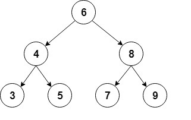

# TreesGrowDownward
build a simple sorted binary tree contains Integer objects.

A binary tree is a _recursive data structure_ where each node can have 2 children at most.

A common type of binary tree is a binary search tree, in which every node has a value that is greater
than or equal to the node values in the left sub-tree, and less than or equal to the node values in the right sub-tree.

Here's a quick visual representation of this type of binary tree:



Take a look at Node.java, it's a very simple container to hold our Integer object.

Now, what operations do yo need to implement in TreeOneZero.java?

## Some Common Operations

Now, let's see the most common operations we can perform on a binary tree. You should step through each operation,
adding the methods described. You'll be making all these changes to class __TreeOneZero__, a special
binary tree class.

### Inserting Elements

The first operation we're going to cover is the insertion of new nodes.

First, we have to find the place where we want to add a new node in order to keep the tree sorted. We'll follow these rules starting from the root node:

`private Node addRecursive(Node current, Integer value)`

- if current node is null, we've reached a leaf node and we can insert the new node in that position
- if the new node's value is lower than the current node's, we call addRecurive on the left child
- if the new node's value is greater than the current node's, we call addRecurive on the right child

Next, we'll create the public method that starts the recursion from the root node:

`public void add(Integer value)`

- we set this.root to `addRecursive` for the value object.

The idea is to create two methods that allow you to do this:
Now let's see how we can use this method to create the tree from our example:

```
private TreeOneZero createBinaryTree() {
    TreeOneZero bt = new TreeOneZero();
 
    bt.add(Integer(6));
    bt.add(Integer(4));
    bt.add(Integer(8));
    bt.add(Integer(3));
    bt.add(Integer(5));
    bt.add(Integer(7));
    bt.add(Integer(9));
 
    return bt;
}
```

### Finding an Element

Let's now add a method to check if the tree contains a specific value.

We will use Recursion to make pretty simple method which can return true or false.
RECURSION is a technique where a method can call **itself**, usually with different parameters, 
based on the current status of the method. 

As before, we'll first create a recursive method that traverses the tree:

`private boolean containsNodeRecursive(Node current, Integer value)`

And it will have two __base cases__, one which returns false, and another which return true. 
If neither case is true, we change the state and call the method itself with changed parameters:

- if current is null, return false
- if current's value equals what we're looking for, return true
- otherwise if the value is less than current's value,
    - call containsNodeRecursive on current's left node
    - otherwise call is on the right node.
    
Build a simple start method to the recursion much like we did with the `add` and `addRecursive` methods:
`public boolean containsNode(Integer value) `

These two methods need to be able to pass a test like this one:

```aidl
@Test
public void givenABinaryTree_WhenAddingElements_ThenTreeContainsThoseElements() {
    BinaryTree bt = createBinaryTree();
 
    assertTrue(bt.containsNode(6));
    assertTrue(bt.containsNode(4));
 
    assertFalse(bt.containsNode(1));
}
```

### Deleting an Element

Another common operation is the deletion of a node from the tree.

By this point, you're starting to see that we have acode pattern here. Define a recursive method, and 
then define a starter method that kicks off the recursion.

First, we have to find the node to delete in a similar way as we did before:

`private Node deleteRecursive(Node current, Integer value)`

Notice here, we want to return the Node we are removing.

Now, Once we find the node to delete, there are 3 main different cases:
     
- a node has no children – this is the simplest case; we just need to replace this node with null in its parent node
- a node has exactly one child – in the parent node, we replace this node with its only child.
- a node has two children – this is the most complex case because it requires a tree reorganization

We can implement the first case when the node is a leaf node:

- if both left and right of this node are null, return null

Now let's continue with the case when the node has one child:

- if the right node is null, return left node
- if the left node is null, return right node

Here, we're returning the non-null child so it can be assigned to the parent node.

Finally, we have to handle the case where the node has two children.

First, we need to find the node that will replace the deleted node. 
We'll use the smallest node of the node to be deleted's right sub-tree:

`private int findSmallestValue(Node n)`

- if the left node is null, return n's object,
- otherwise call findSmallestValue on n's left node

Then, we assign the smallest value to the node to delete and after that, we'll delete it from the right subtree:

int smallestValue = findSmallestValue(current.right);
current.value = smallestValue;
current.right = deleteRecursive(current.right, smallestValue);
return current;

Finally, let's create the public method that starts the deletion from the root:

`public void delete(Integer value)`

Now, let's check that the deletion works as expected:

```
@Test
public void givenABinaryTree_WhenDeletingElements_ThenTreeDoesNotContainThoseElements() {
    BinaryTree bt = createBinaryTree();
 
    assertTrue(bt.containsNode(9));
    bt.delete(9);
    assertFalse(bt.containsNode(9));
}
```

### Traversing (Walking or Visiting) the Tree

In this section, we'll see different ways of traversing a tree, covering in detail the depth-first and breadth-first searches.

We'll use the same tree that we used before and we'll show the traversal order for each case.

#### Depth-First Search

Depth-first search is a type of traversal that goes deep as much as possible in every child before exploring the next sibling.

There are several ways to perform a depth-first search: in-order, pre-order and post-order.

The in-order traversal consists of first visiting the left sub-tree, then the root node, and finally the right sub-tree:

`public void traverseInOrder(Node node)`

It would do something like:
- if node is not null
  - traverseInOrder(node.left)
  - print(" " + node.value)
  - traverseInOrder(node.right)
    

If we call this method, the console output will show the in-order traversal:

3 4 5 6 7 8 9

Pre-order traversal visits first the root node, then the left subtree, and finally the right subtree:

`public void traversePreOrder(Node node)`

Look carefully how this is different from **in order**.

- if (node != null) 
  - print(" " + node.value)
  - traversePreOrder(node.left)
  - traversePreOrder(node.right)

And let's check the pre-order traversal in the console output:

6 4 3 5 8 7 9

Post-order traversal visits the left subtree, the right subtree, and the root node at the end:

`public void traversePostOrder(Node node)`

- if (node != null) 
  - traversePostOrder(node.left)
  - traversePostOrder(node.right)
  - print(" " + node.value)

Here are the nodes in post-order:

3 5 4 7 9 8 6

#### Breadth-First Search

This is another common type of traversal that visits all the nodes of a level before going to the next level.

This kind of traversal is also called level-order and visits all the levels of the tree starting from the root, and from left to right.

For the implementation, we'll use a Queue to hold the nodes from each level in order. We'll extract each node from the list, print its values, then add its children to the queue:

This is the most complex of the routines, and it's a gift :-)

```java
public void traverseLevelOrder() {
    if (root == null) {
        return;
    }
 
    Queue<Node> nodes = new LinkedList<>();
    nodes.add(root);
 
    while (!nodes.isEmpty()) {
 
        Node node = nodes.remove();
 
        System.out.print(" " + node.value);
 
        if (node.left != null) {
            nodes.add(node.left);
        }
 
        if (node.right != null) {
            nodes.add(node.right);
        }
    }
}
```

In this case, the order of the nodes will be:

6 4 8 3 5 7 9
